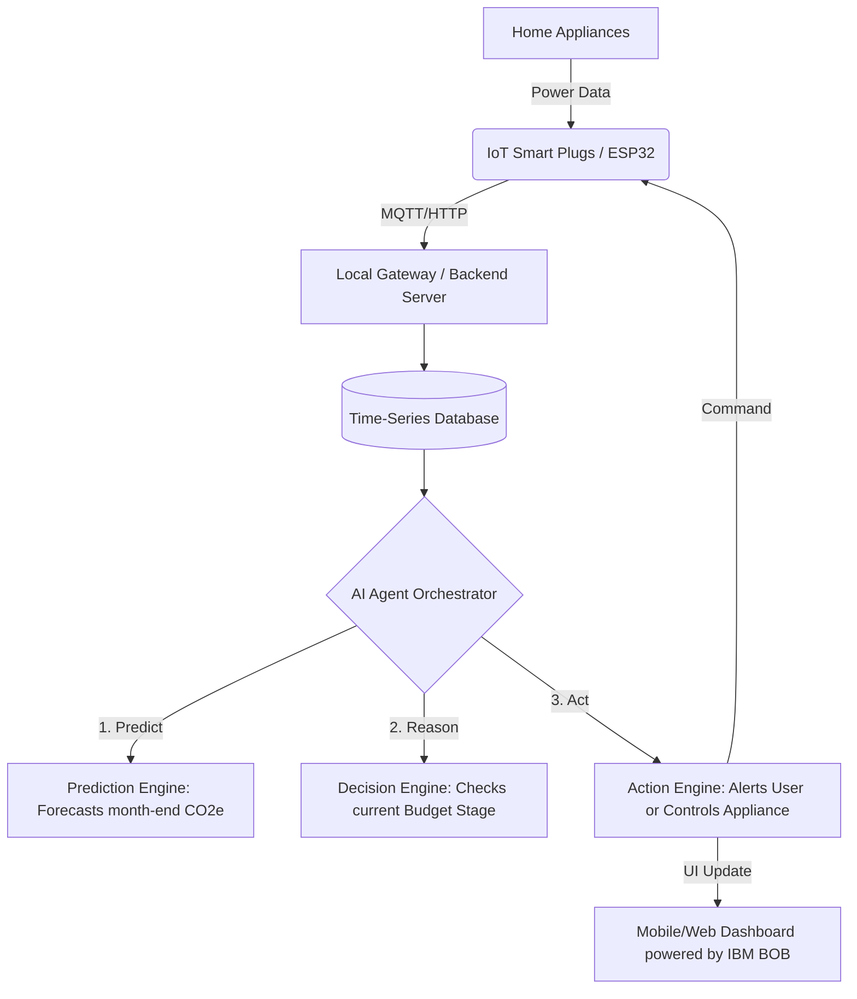

# 1M1B AI for Sustainability Virtual Internship
## Final Project Deliverable

---

### 1. Project Description

**Title:** Home Carbon Bank – AI-Powered Smart Carbon Management System
**Student Name:** [Your Name]
**College Name:** [Your College Name]

**SDG Alignment:** 
*   **Primary:** SDG 12 (Responsible Consumption and Production)
*   **Secondary:** SDG 13 (Climate Action) & SDG 7 (Affordable and Clean Energy)

**Problem Statement:** 
*How might we use AI to intelligently monitor, predict, and optimize household energy consumption so that families can actively stay within a sustainable carbon budget without sacrificing essential comfort or safety?*

**AI Solution Overview:** 
The Home Carbon Bank is an AI-driven, IoT-enabled ecosystem that treats household carbon emissions like a digital bank account. It continuously reads energy data from smart plugs, calculates the real-time CO₂-equivalent (CO₂e) footprint, and maintains a "Carbon Budget." **IBM BOB** was utilized during the ideation and development phase to simulate the AI agent's decision-making logic and refine the prompt workflows. In the execution stage, the system uses Agentic AI to predict end-of-month emissions and takes progressive action—ranging from soft warnings to autonomous optimization of non-essential appliances.

**Target Users:** 
*   Eco-conscious homeowners and renters.
*   Smart-home enthusiasts looking to optimize energy usage.
*   Households looking to reduce their monthly electricity bills.

**Responsible AI Considerations:**
*   **Safety & Ethics:** The AI operates on a strict user-defined priority hierarchy. It is hard-coded to *never* autonomously disable essential devices (e.g., medical equipment, refrigerators). 
*   **Transparency:** The AI provides clear "explainability" for its predictions (e.g., "I am predicting a budget overflow because your AC usage increased by 22%").
*   **Privacy:** Energy data processing prioritizes local edge-computing. Any cloud data is anonymized and strictly used for the user’s own insights.

---

### 2. Prototype / Demo (Agentic Logic & Architecture)

As a Computer Engineering student, this prototype focuses on the **Agentic AI Logic**, the **System Architecture**, and the integration of **IBM BOB** for conversational insights.

#### A. System Architecture Flow

#### B. Agentic Logic (State Machine Prototype)
The core of the prototype relies on the AI evaluating the household's current state and triggering logic loops. **IBM BOB** was used to prototype and refine these state thresholds.

*   **STAGE 1: Normal (< 70% Budget)**
    *   **Logic:** `IF current_co2e < 0.7 * total_budget AND predicted_co2e < total_budget:`
    *   **Action:** Passive logging. No AI intervention.

*   **STAGE 2: Warning (70% - 85% Budget)**
    *   **Logic:** `IF current_co2e >= 0.7 * total_budget OR predicted_co2e > total_budget:`
    *   **Action:** Trigger AI to analyze the anomaly and generate an insight prompt for the dashboard.
    *   *AI Output:* "Warning: Your household is consuming carbon faster than usual. Your water heater accounts for 40% of today's usage."

*   **STAGE 3: Smart Optimization (85% - 95% Budget)**
    *   **Logic:** `IF current_co2e >= 0.85 * total_budget AND auto_manage == TRUE:`
    *   **Action:** Agent queries the database for 'Important' appliances currently running.
    *   *Agent Action:* Increases AC setpoint by 1°C via API; sends push notification to user detailing the automated action.

*   **STAGE 4: Critical (> 95% Budget)**
    *   **Logic:** `IF current_co2e >= 0.95 * total_budget:`
    *   **Action:** Agent triggers hard-stop protocols for 'Non-Essential' appliances (e.g., Decorative lights). Warns user of impending budget breach.

#### C. The "Take Carbon Action" Prompt Workflow (Powered by IBM BOB)
When the user presses the "Take Carbon Action" button on the dashboard, the backend triggers this specific prompt workflow to the underlying **IBM BOB** conversational interface:

**System Prompt:** 
> "You are an intelligent Home Carbon Assistant powered by IBM BOB. The user's monthly budget is 300 kg CO₂e. They have used 280 kg CO₂e (93%). The top consumers today are: 1. AC (12 hours, 15 kg), 2. Gaming PC (6 hours, 4 kg). Suggest 3 immediate, temporary actions they can take right now to avoid exceeding their budget. Format as actionable bullet points with estimated savings."

---

### 3. Impact Statement

**What changes if this solution is implemented?**
Currently, household carbon footprint tracking is passive—users look at their electricity bill at the end of the month when it is too late to change it. This solution shifts energy management from **passive observation to proactive, AI-driven intervention**. By gamifying the experience with a "Carbon Budget" and automating reductions, households can actively prevent unnecessary emissions before they happen.

**Who benefits and how?**
1.  **The Environment:** Direct reduction in household greenhouse gas emissions through optimized consumption.
2.  **The Consumer:** Lower monthly electricity bills and an increased awareness of personal environmental impact.
3.  **Power Grids / Utilities:** By intelligently delaying non-essential appliance usage, the system effectively acts as a decentralized demand-response mechanism, helping to stabilize the grid during peak load hours.
